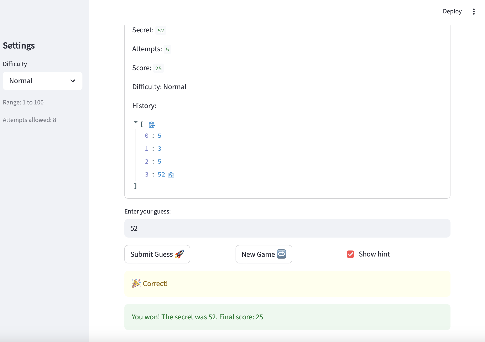

# 🎮 Game Glitch Investigator: The Impossible Guesser

## 🚨 The Situation

You asked an AI to build a simple "Number Guessing Game" using Streamlit.
It wrote the code, ran away, and now the game is unplayable. 

- You can't win.
- The hints lie to you.
- The secret number seems to have commitment issues.

## 🛠️ Setup

1. Install dependencies: `pip install -r requirements.txt`
2. Run the broken app: `python -m streamlit run app.py`

## 🕵️‍♂️ Your Mission

1. **Play the game.** Open the "Developer Debug Info" tab in the app to see the secret number. Try to win.
2. **Find the State Bug.** Why does the secret number change every time you click "Submit"? Ask ChatGPT: *"How do I keep a variable from resetting in Streamlit when I click a button?"*
3. **Fix the Logic.** The hints ("Higher/Lower") are wrong. Fix them.
4. **Refactor & Test.** - Move the logic into `logic_utils.py`.
   - Run `pytest` in your terminal.
   - Keep fixing until all tests pass!

## 📝 Document Your Experience

- [X] Describe the game's purpose.
- [X] Detail which bugs you found.
- [X] Explain what fixes you applied.

- The purpose of the game is for a player to guess a secret number between 1-100, receiving optional hints after each guess before the attempts run out. 

- (1) Hint logic was inverted — told player to go lower when the secret was higher, and vice versa
- (2) Hints suggested out-of-range guesses — e.g. "go lower" when the player already guessed 1
- (3) The "New Game" button did not work after finishing a game — required a full page refresh to play again

- (1) Swapped the hint conditional so guess > secret correctly returns "Go LOWER" and guess < secret returns "Go HIGHER"
(2) Added input validation to reject guesses outside 1–100 and display a clear out-of-range error message
(3) Reset session state (status and attempts) when the New Game button is pressed so the game restarts without a page refresh

## 📸 Demo

- [X] 

## 🚀 Stretch Features

- [ ] [If you choose to complete Challenge 4, insert a screenshot of your Enhanced Game UI here]
